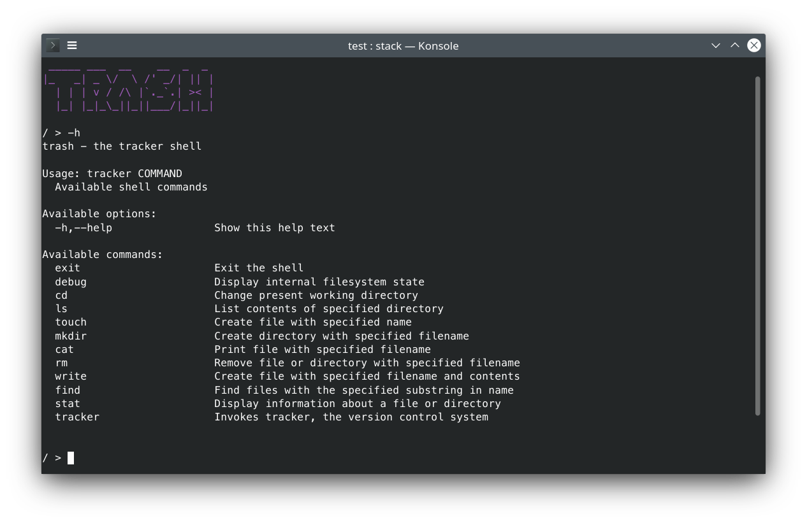

# Trash — The Tracker Shell
[](https://github.com/IlyaBizyaev/trash/blob/master/LICENSE)


This repository contains a small shell implementation that has some basic file management commands and a tiny VCS called Tracker.
It was developed for educational purposes during the [Functional Programming course](https://github.com/jagajaga/itmo-fp-2020) at ITMO University.



The idea was to read the file system state of a sufficiently small directory into memory, and then use pure functions to operate on that state.  
Supported file management operations include file and directory creation, display, modification, and removal. The built-in version control tool,
`tracker`, is capable of storing indexed file revisions, logging file modification history and reverting to previous versions. Directories are
treated as a list of their contents.

On exit, the resulting state is written back to the storage. Revision history and metadata are saved into a `.tracker` subdirectory.

The name was inspired by [crosh](https://chromium.googlesource.com/chromiumos/platform2/+/master/crosh/README.md) and limited practical
benefit of the program.

## Usage 🚀
### Running
```bash
$ stack run
```

### Commands
**📂 File management:** use `-h` in REPL for a list of supported FM commands.

**⏳ Version control:** use `tracker -h` in REPL for a list of supported VCS commands.

_Disclaimer_: due to limited testing, bugs are to be expected.

## Development
### Building
```bash
$ stack build
```

## Copyright
2020 Ilya Bizyaev <me@ilyabiz.com>, GPL 3+
