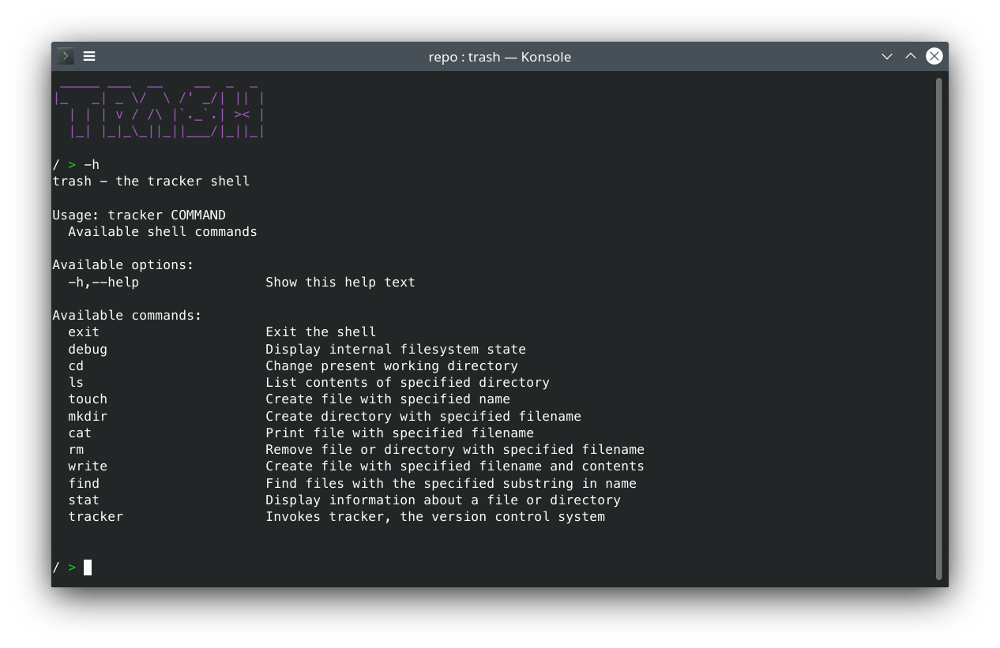

# Trash — The Tracker Shell
[](https://github.com/IlyaBizyaev/trash/blob/master/LICENSE)


This repository contains a small shell implementation that has some basic file management commands and a tiny VCS called Tracker.
It was developed for educational purposes during the [Functional Programming course](https://github.com/jagajaga/itmo-fp-2020) at ITMO University.
Inspired by [crosh](https://chromium.googlesource.com/chromiumos/platform2/+/master/crosh/README.md).



## Usage
### Running
```bash
$ stack run
```

### Commands
**File management:** use `-h` in REPL for a list of supported FM commands.

**Version control:** use `tracker -h` in REPL for a list of supported VCS commands.

## Development
### Building
```bash
$ stack build
```

## Copyright
2020 Ilya Bizyaev <me@ilyabiz.com>, GPL 3+
